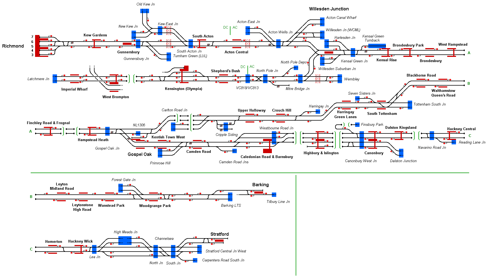

# North London Line 
This simulation covers a large portion of the central region of the London Overground rail network. The map includes the North London Line, Gospel Oak to Barking Line, and West London Line. The map is based on the state of the network in 2022.

## Current Status

| Stage         | Status        |
| ------------- |:-------------:|
| Track Plan     | :heavy_check_mark: |
| Signalling      | :heavy_check_mark:      |
| Naming | :heavy_check_mark:      |
| Speed Limits | :heavy_check_mark: |
| Distances | :x: |
| Timetable | :x: |
| Documentation | :x: |

## Data Sources

- [The National Electronic Sectional Appendix](https://www.networkrail.co.uk/industry-and-commercial/information-for-operators/national-electronic-sectional-appendix/)
- [Drivers Eye View (Cab Ride) : Clapham Junction to Watford Junction via West London Line](https://www.youtube.com/watch?v=zBsUwI8IOC4) by B.PM.R on YouTube
- [London Overground's Drivers Eye View Gospel Oak to Barking](https://www.youtube.com/watch?v=k-_EE4ywQzg) by Darren J on YouTube
